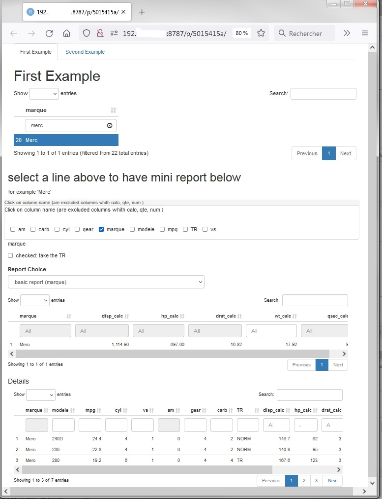
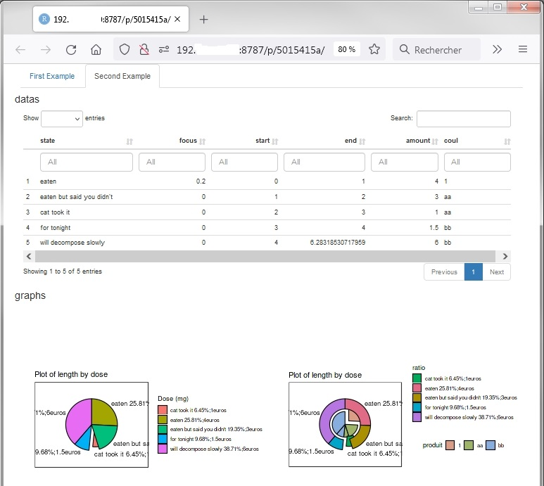

## This POC is coming from StackOverflow post

- question :  [Wrapping shiny modules in R6 classes](https://stackoverflow.com/questions/46693161/wrapping-shiny-modules-in-r6-classes)
- August 2019, my reprex proposal: [I am beginner in R6 and OOP. Here is a reprex](https://stackoverflow.com/questions/46693161/wrapping-shiny-modules-in-r6-classes/57464394#57464394)

## My answer updated a little for github

I am beginner in R6 and OOP.

Here is a reprex that I've done in classic Shiny code calling R6 modules in two panels. 

It's inspired by : 

- [march 25, 2019, zhuchcn.github.io: Modularize your shiny app using shiny module and R6 class](https://zhuchcn.github.io/projects/posts/en/2019-03-25/), written by Chenghao Zhu,  but in his case the code is 100% OOP i.e. also in ui et server. In my case it's for reusability in my project in classic Shiny code.


- [July 20, 2018, tbradley1013.github.io: Using global input values inside of R Shiny modules](https://tbradley1013.github.io/2018/07/20/r-shiny-modules--using-global-inputs/), written by Tyler Bradley, where he made a demonstration to use `reactive(myreactive())` in the call of modules. 


For the two last questions:

- 3 : I think there is not issue about nested module, in my example at least. If I understood the question.
- 4 : I've looking for static function at the beginning for UI side, because of the instanciation too late in the server side. But except the root of my UIs R6 class, which could be in static or not in R6, all of my UIs R6 are in fact in the server side.


code updated : `observeEvent(..[R6 module called]..., once=TRUE)` added, bugs fixed, hidden `textInput()` removed

### Code abstract

__ui__ (please, look at view code on github :
[RShinyR6PoC_ui_rshiny.R](https://github.com/philibe/RShinyR6POC/blob/main/ui_server_rshiny/ui_rshiny/RShinyR6PoC_ui_rshiny.R) )
```R
[..]
fluidRow(
   BaseMiniRapportTabDynUI$MiniRapportTabDynUI_UI("FirstExample")
),
[..]
```


__server__ (please, look at view code on github:
[RShinyR6PoCUI_server_rshiny.R](https://github.com/philibe/RShinyR6POC/blob/main/ui_server_rshiny/server_rshiny/RShinyR6PoCUI_server_rshiny.R) )
```R
[..]
FicheTabGraph$new(input, output, session,"SecondExample",
				 list("datas","graphs"),
				 list("RatioPlotUI","RepartitionCoutPlotUI"),
				 reactive(DonneesPie()),
				 DetailsTableInFormatOutput.Fct=Global.Fiche.output.fct
)
FicheGraph1<-FicheGraph$new(input, output, session,"SecondExample",reactive(DonneesPie()),
						   pie_plot_table.fct,
						   pie_plot_plot.fct,
						   cible="RatioPlotUI"
)
FicheGraph1

[..]
```

__Modules_R6_Examples.R__ (please, look at view code [splited in 3 files on github](https://github.com/philibe/RShinyR6POC/tree/main/modules) )
```R
#  called in UI
FicheTabGraphUI = R6Class(
  "FicheTabGraphUI",
  public = list(
    FicheTabGraphUI_UI= function (prefixe){
      ns<-NS(prefixe)
      tagList(
        uiOutput(ns("FicheTabGraphUI_UI"))
      )
    }
  )
)

#  called in SERVER
FicheTabGraph = R6Class(
  "FicheTabGraph",
  public = list(
    id = NULL,
    ns =NULL,
    ListeTitres=NULL,
    ListeIdGraphs=NULL,
    DetailsTableIn=NULL,
    RapportCourant.react=NULL,
    DetailsTableInFormatOutput.Fct=NULL ,
    # initializer
    initialize = function(input,output, session,id,ListeTitres,ListeIdGraphs,DetailsTableIn,
                          DetailsTableInFormatOutput.Fct =NULL){
      self$id = id
      self$ns = NS(id)
      self$SetListeTitres(ListeTitres)
      self$SetListeIdGraphs(ListeIdGraphs)
      self$DetailsTableInFormatOutput.Fct=function (mydatatable) {DT::datatable( mydatatable)}
      callModule(private$FicheTabGraphSERVER,self$id )
      private$server(input, output, session, DetailsTableIn,DetailsTableInFormatOutput.Fct)
    },
    [..]
)


#  called in SERVER
FicheGraph = R6Class(
  "FicheGraph",
  public = list(
    id = NULL,
    ns =NULL,
    DetailsTableIn=NULL,

    # initializer
    initialize = function(input,output, session,id,DetailsTableIn,
                          RatioTable.Fct,RatioPlot.Fct,cible
    ){
      self$id = id
      self$ns = NS(id)

      self$SetDetailsTableIn(DetailsTableIn)
      callModule(private$RatioPlotSERVER, self$id,self$DetailsTableIn, RatioTable.Fct,RatioPlot.Fct,cible )

    },

    SetDetailsTableIn = function(DetailsTableIn ) {
      if (missing(DetailsTableIn)) return(self$DetailsTableIn)
      self$DetailsTableIn<-DetailsTableIn
    },
    server= function(input, output, session,DetailsTableIn=self$DetailsTableIn,
                     RatioTable.Fct,RatioPlot.Fct,cible ) {

      callModule(private$RatioPlotSERVER, self$id,DetailsTableIn, RatioTable.Fct,RatioPlot.Fct,cible )

    }),
 [ private= list(
    RatioPlotSERVER = function(input, output, session,
                               DetailsTableIn,RatioTable.Fct,RatioPlot.Fct,cible ) {

      output[[cible]] <- renderPlot(RatioPlot.Fct( RatioTable.Fct(DetailsTableIn())))
    }
  )[..]
)

# called in UI
MiniRapportTabDynUI = R6Class(
  "MiniRapportTabDynUI",
  public = list(
    MiniRapportTabDynUI_UI= function (prefixe, tagParamFiltre){
      ns<-NS(prefixe)
      tagList(
        uiOutput(ns("MiniRapportTabDynUI_UI"))
      )
    }
  )
)


# called in SERVER
MiniRapportTabDyn = R6Class(
  "MiniRapportTabDyn",
  public = list(
    id = NULL,
    ns =NULL,
    ConsolidationFormatOutput.Fct=NULL,
    DetailsTable=NULL,
    RapportsList=NULL,
    RapportCourant.react=NULL,
    liste_colonnes_choisies.react=NULL,
    reactValues=NULL,
    # initializer
    initialize = function(input, output, session,id, tagParamFiltre=div()){
      self$id = id
      self$ns = NS(id)
      callModule(self$MiniRapportTabDynSERVER, self$id, tagParamFiltre )
      self$ConsolidationFormatOutput.Fct=function (mydatatable) {DT::datatable( mydatatable)}
    },
    [...]
)
```



